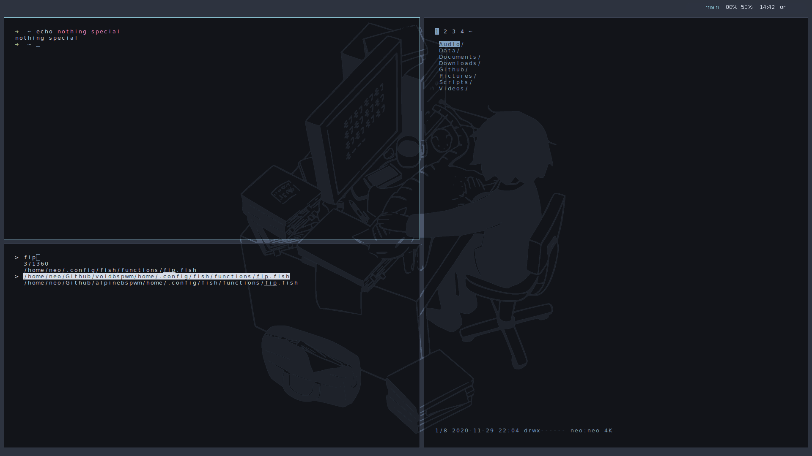

```bash
   ____________
  ( decelerate )
   ------------
          \   ^__^
           \  (oo)\_______                  v o i d b s p w m  ←
              (__)\       )\/\
                  ||----w |
                  ||     ||
```

<br/>

## 1: installation

[void](https://voidlinux.org/download/) base live image & [installation guide](https://docs.voidlinux.org/installation/live-images/guide.html).

```bash
# wireless connection during installation:

bash
loadkeys <my_country_code>
ln -s /ect/sv/wpa_supplicant /var/service/
rfkill unblock wifi
iw dev | grep -i 'interface'
iw dev <interface> scan | grep -i 'ssid'
wpa_passphrase <ssid> <passphrase> | tee /etc/wpa_supplicant/wpa_supplicant-<interface>.conf
ip link set <interface> up
wpa_supplicant -B -i <interface> -c /etc/wpa_supplicant/wpa_supplicant-<interface>.conf
dhcpcd <interface>
ping -c 4 gnu.org
void-installer
```

## 2: git, clone

```
sudo xbps-install -S git
$ git clone https://github.com/doleovit/voidbspwm.git
```

## 3: run script

```
$ bash voidbspwm/install.sh
```

## overview

<p align="center">

</p>


```bash

# packages: install.sh


   runit─┬─picom───4*[{picom}]
         ├─polybar───7*[{polybar}]
         ├─runsvdir─┬─runsv───udevd───udevd
         │          ├─runsv───uuidd
         │          ├─runsv───dhcpcd
         │          ├─runsv───wpa_supplicant
         │          ├─runsv───run───sleep
         │          ├─runsv───agetty
         │          ├─runsv───acpid
         │          └─runsv───login───startx───xinit─┬─Xorg
         │                                           └─bspwm
         └─sxhkd
```
<br/>

```bash
# essentials
 super + u → release → press 1   # poweroff
 super + u → release → press 2   # reboot↓↑
 $ zzz   # sp -
# connection
 $ on    # go ↑
 $ off   # go ↓
```

## ~ screen

```
if you run 'it' in a vm, adapt line 27 of
bspwmrc (default 1920x1080) to your needs
```

## ~ keymap

find your [country - code](https://en.wikipedia.org/wiki/ISO_3166-1_alpha-2#Officially_assigned_code_elements), and replace the [existing one](https://github.com/doleovit/voidbspwm/blob/main/home/.config/bspwm/bspwmrc#L36).

```bash
setxkbmap -layout fr   # french example
```

## polybar
```
workspace | battery | alsa ( klick → mute ) | time ( klick → date ) | connection
```

## trivials

```bash
.. but non-self-explanatory
 - $ mkdir Documents Temp Downloads  # whatever
 - local-video-profile: $ mpvl <_path_to_file_>
 - local-audio-detached: $ ffp <_path_to_file_>
 | radio-detached: $ fip  # stress ; acid jazz?
 | quit 'em both: super + alt + u → release → m
 - font dpi = 96; no match? edit: ~/.Xresources
 - 4 cheat sheet: super + u → release → press h
 - interrupt key = ctrl+shift+c (ctrl+c = copy)
```

## detangle

if a package depends on an [ignored package](https://github.com/doleovit/voidbspwm/blob/main/install.sh#L42 "klick for a complete overview"), the dependency will be satisfied without installing the ignored package. examine whatever package you choose, or choose to

```bash
# ↓↓       revise these choices        ↓↓
sudo rm /etc/xbps.d/<№>-ignore-<pkg>.conf
```

## function

```bash
$ flh       # ~ files *
$ fla       # / files *
$ exh       # ~ executables *
$ exa       # / executables *
$ ccc       # can break stuff
$ zzz       # get rid of sudo
$ nnn       # tiny adjustment
$ lck       # <x> lock screen
$ rlp       # regenerate linux
$ enc       # <foo> encryption
$ dec       # <foo> decryption
$ img       # picture overview
$ iso       # wipe -a/-o write
$ tma       # posttransmission
$ cfn       # cleanup filename
$ pdf       # detached μpdf ↑r
$ mix       # jumbled overview
$ mac       # Δ of mac address
$ dmes      # more less  dmesg
$ trim      # fstrim / +output       __________________________________
$ lmod      # more less  lsmod      ( * toggle preview: ! open nvim: ? )
$ mpvl      # mpv localprofile       ----------------------------------
$ deps      # <foo> pkg ↑deps            \   ^__^
$ fhd       # <foo> dd fish h             \  (oo)\_______
$ svs       # status services                (__)\       )\/\
$ ffp       # ffplay detached                    ||----w |
$ fip       # wradio detached                    ||     ||
$ off       # wlan go offline
$ pov       # all pkgs ov ↓ v
$ iov       # explicit ov ↓ v
$ nvs       # neovim sudoedit
$ dtu       # <foo>  dos2unix
$ man       # more less 4 man
$ ipt       # (oo) iptables r
$ 2fa       # <foo>  oathtool
$ mpc       # kernel ↓modules
$ sh2       # sync /home/ to:
$ xl        # x11 server logs
$ cd        # cd + list files
$ nt        # note ? → $ nt h
$ on        # wlan  go online
$ ov        # number of  pkgs
$ tp        # more less tlpst
$ zk        # a zombie killer
$ se        # hwmon  coretemp
$ qv        # <kuh> ? var set
$ rs        # reset  terminal
$ fp        # fish record off
$ vi        # stands 4 neovim
```

## shorten

```bash
$ inxi      # ↑ output +filter
$ gpg2      # no shell history
$ pass      # no shell history
$ fhd       # no shell history
$ 2fa       # no shell history
$ dec       # no shell history
$ enc       # no shell history
$ nt        # no shell history
$ rm        # careful +verbose
```

## binding

- `super + u` → release → [press](https://github.com/doleovit/voidbspwm/blob/main/home/.config/sxhkd/sxhkdrc) `p`
- `$ flh` → and search for → `sxhk`

## theend

>“there are two ways of constructing a software design: one way is to make it so simple that there are obvious~~ly no~~ deficiencies and the other way is to make it so complicated that there are no obvious deficiencies.”
>
>( ~ c.a.r. hoare, 1980 acm turing award lecture )
